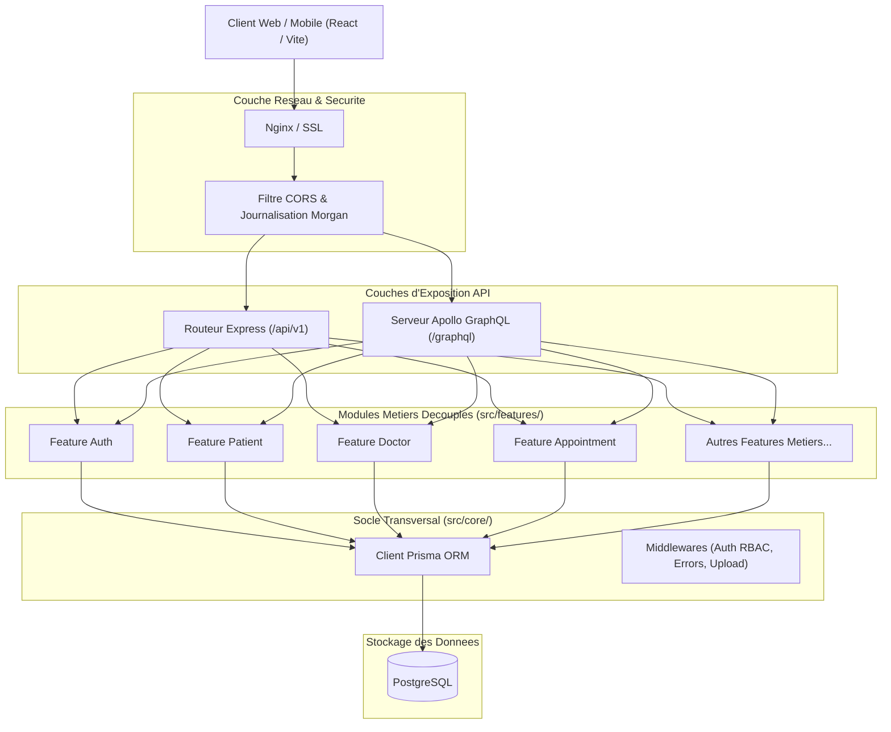
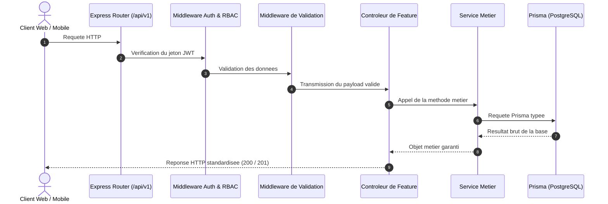

# Architecture Technique - MediBloc Backend

## 1. Vue d'Ensemble Fonctionnelle et Modulaire

MediBloc Backend est concu selon une architecture modulaire par fonctionnalite (Feature-Based / Vertical Slice) associee a une separation stricte entre la couche de transport HTTP (Express), la couche de transport GraphQL (Apollo Server), la couche de logique metier (Services) et la couche de persistance des donnees (Prisma ORM / PostgreSQL).



---

## 2. Decoupage de l'Arborescence du Projet

```txt
backend/
├── docs/                                   # Documentation technique
│   ├── architecture/
│   │   └── Architecture.md
│   └── conventions/
│       └── Conventions.md
│
├── prisma/
│   ├── schema.prisma                       # Schemas et modeles de donnees
│   └── seed.ts                             # Donnees initiales de demonstration
│
├── src/
│   ├── core/                               # Socle technique commun
│   │   ├── configs/                        # Configurations environnement, DB, Swagger
│   │   ├── middlewares/                    # Middlewares d'authentification, d'erreurs, etc.
│   │   ├── utils/                          # Utilitaires generaux (reponses, hash, parsers)
│   │   ├── types/                          # Typages transversaux
│   │   └── generics/                       # Abstractions generiques
│   │
│   ├── features/                           # Fonctionnalites autonomes (Vertical Slices)
│   │   ├── appointment/                    # Gestion des rendez-vous
│   │   ├── auth/                           # Authentification et securite
│   │   ├── discussion/                     # Messagerie et echanges
│   │   ├── disease/                        # Maladies et pathologies
│   │   ├── doctor/                         # Profils praticiens et disponibilites
│   │   ├── hotspot/                        # Surveillance epidemiologique
│   │   ├── invoice/                        # Factures et reglements
│   │   ├── medical-record/                 # Dossiers medicaux
│   │   ├── medicine/                       # Catalogue des medicaments
│   │   ├── notification/                   # Notifications utilisateurs
│   │   ├── patient/                        # Profils patients et suivis
│   │   ├── pharmacy/                       # Annuaire des officines
│   │   ├── prescription/                   # Ordonnances medicales
│   │   ├── review/                         # Evaluations et notations
│   │   ├── stats/                          # Indicateurs et tableaux de bord
│   │   ├── symptom/                        # Symptomes cliniques
│   │   ├── upload/                         # Fichiers et pieces jointes
│   │   └── user/                           # Comptes utilisateurs et identites
│   │
│   ├── graphql/                            # Agregateur GraphQL centralise
│   │   ├── schemas/                        # Agregation des schemas des features
│   │   ├── resolvers/                      # Agregation des resolvers des features
│   │   └── servers/                        # Montage du serveur Apollo
│   │
│   ├── routes/                             # Routes racines de l'application
│   │   └── app/
│   │       └── index.routes.ts
│   │
│   └── app/
│       └── index.ts                        # Initialisation et bootstrap du serveur
```

---

## 3. Separation des Responsabilites au Sein d'une Feature

Pour chaque fonctionnalite, le flux de traitement des requetes respecte le decouplage suivant :

1. **Controleur (`controllers/`)** : Recoit la requete HTTP Express, extrait les donnees validees du corps ou des parametres, invoque le service metier correspondant et formate la reponse HTTP via le standard JSON.
2. **Service (`services/`)** : Contient l'integralite de la logique metier et execute les operations de persistance via Prisma. Le service est neutre vis-a-vis du protocole et peut etre appele indifferemment par un controleur REST ou un resolveur GraphQL.
3. **Validateur (`validations/`)** : Definit les regles de conformite des donnees entrantes (champs obligatoires, formats d'email, plages de valeurs).
4. **Interfaces et DTOs (`interfaces/`, `types/`, `dtos/`)** : Garantissent un typage strict et exhaustif des donnees entrantes et sortantes sans recourir a `any` ou `unknown`.
5. **Composants GraphQL (`graphql/`)** : Contiennent les schemas SDL (`schemas/`), les requetes (`queries/`), les mutations (`mutations/`) et les resolveurs (`resolvers/`) specifiques au domaine metier.

---

## 4. Cycle de Vie d'une Requete


